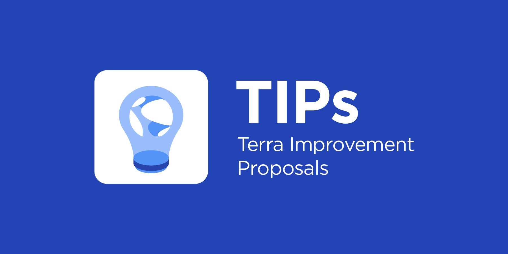

# Terra Improvement Proposals (TIPs)

TIPs are a way to standardize proposed changes to the Terra core. Each TIP should be written using the templates found in this repo. The [TIP template](./tip-template) contains instructions on each section in the raw markdown. Read the [TIP example](./tip-example.md) to see how to write a good TIP. 

- [TIP markdown template](./tip-template.md)
- [TIP example](./tip-example.md)
- [TIP Github issue template](./.github/ISSUE_TEMPLATE/terra-improvement-proposal--tip-.md)


## Anatomy

TIPs are arranged in the following structure:

```
Title: TIP # 01 Your Title Here
│ 
├── General info: TIP #, Author, Network, Date
├── Summary: A brief summary of the change in plain English. 
├── Motivation: The problem; why the change needs to be made.
│ 
├── Tech Spec
│   ├── Modules: A list of the affected modules. 
│   ├── Overview: The solution; a technical overview of the change. 
│   ├── Method: How the change will be implemented.
│   ├── Code: Examples of the code involved. 
│   └── Considerations: General considerations or cautions. 
│ 
├── Timeline: The timeframe needed to complete the change.
└── Tests: A list of tests implemented or needed. 
```

## Writing TIPs

A TIP should be clear and concise. 

After reviewing a TIP, a reader should have a clear idea of the following:

- What the change is (Summary and Overview).
- Why the change needs to be made (Motivation).
- How the change will be made (Method).
- The technical details of the change (Tech Spec, Code, and Considerations).
- What success looks like (Outcome).
- Lead time and testing details (Timeline, Tests).

There is no set length for TIPs. Each TIP should clearly outline a necessary change. More complex TIPs will naturally be longer. Keep TIPs succinct while providing all pertinent info. 

Generally, shorter sentences are easier to write and read. Avoiding unnecessarily complex clauses will help clarify your writing. 

