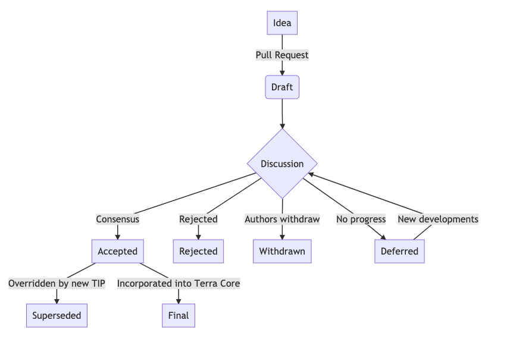

## What is a TIP?

TIP stands for Terra Improvement Proposal. An TIP is a design document providing information to the Terra community, or describing a new feature for Terra or its processes or environment. The TIP should provide a concise technical specification of the feature and a rationale for the feature. The TIP author is responsible for building consensus within the community and documenting dissenting opinions.

## TIP Rationale

We intend TIPs to be the primary mechanisms for proposing new features, for collecting community technical input on an issue, and for documenting the design decisions that have gone into Terra. Because the TIPs are maintained as text files in a versioned repository, their revision history is the historical record of the feature proposal.

Because Terra is a community-governed blockchain, TIPs are a convenient way to track the history and progress of implementation.

## TIP Types

There are three types of TIPs:

- A **Standards Track TIP** describes any change that affects most or all Terra implementations, such as a change to the network protocol, a change in block or transaction validity rules, proposed application standards/conventions, or any change or addition that affects the interoperability of applications using Terra. Standards Track TIPs consist of three parts, a design document, implementation, and finally, if warranted, an update to the Terra protocol specification.

- A **Process TIP** describes a process surrounding Terra or proposes a change to (or an event in) a process. Process TIPs are like Standards Track TIPs but apply to areas other than the Terra protocol itself. They may propose an implementation, but not to Terra's codebase; they often require community consensus; unlike Informational TIPs, they are more than recommendations, and users are typically not free to ignore them. Examples include procedures, guidelines, changes to the decision-making process, and changes to the tools or environment used in Terra development. Any meta-TIP is also considered a Process TIP.

- An **Informational TIP** describes an Terra design issue, or provides general guidelines or information to the Terra community, but does not propose a new feature. Informational TIPs do not necessarily represent Terra community consensus or a recommendation, so users and implementers are free to ignore Informational TIPs or follow their advice.

A TIP must meet certain minimum criteria. It must be a clear and complete description of the proposed enhancement. The enhancement must represent a net improvement. The proposed implementation, if applicable, must be solid and must not complicate the protocol unduly.

## TIP Workflow

Parties involved in the process are you, the champion or TIP author, the maintainers of the TIPs repository, and the Terra Core Developers (currently Terraform Labs).

Before you begin writing a formal TIP, you should vet your idea. Ask the Terra community first if an idea is original to avoid wasting time on something that will be be rejected based on prior research. It is thus recommended to open a discussion thread on the [Terra Agora](https://agora.terra.money) forum to do this, but you can also use the [Terra official Discord](https://discordapp.com/invite/bYfyhUT).

### TIP Process

The TIP process begins with a new idea for Terra. It is highly recommended that a single TIP contain a single key proposal or new idea. Small enhancements or patches often don’t need a TIP and can be injected into the Terra development workflow with a pull request to the [Terra Core repo](https://github.com/terra-project/core). The more focused the TIP, the more successful it tends to be. If in doubt, split your TIP into several well-focused ones.



1. All TIPs should be created with the `Draft` status.

2. Eventually, after discussion, there may be consensus that the TIP should be accepted -- see the next section for details. At this point the status becomes `Accepted`.

3. Once a TIP has been `Accepted`, the reference implementation must be completed. When the reference implementation is complete and incorporated into the main source code repository, the status will be changed to `Final.`

A TIP can also be assigned status `Deferred.` The TIP author or a core developer can assign the TIP this status when no progress is being made on the TIP.

A TIP can also be `Rejected`. Perhaps after all is said and done it was not a good idea. It is still important to have a record of this fact. The `Withdrawn` status is similar—it means that the TIP author themselves has decided that the TIP is actually a bad idea, or has accepted that a competing proposal is a better alternative.

When a TIP is `Accepted`, `Rejected`, or `Withdrawn`, the TIP should be updated accordingly by changing the Status header.

TIP can also be `Superseded` by a different `TIP`, rendering the original obsolete. The `Superseded-By` and `Replaces` headers should be added to the original and new TIPs respectively.

Process TIPs may also have a status of `Active` if they are never meant to be completed, e.g. `TIP-1` (this TIP).

### How a TIP gets Accepted

A TIP is `Accepted` through the following:

1. Consensus from the Terra Core Developers

2. Ratified via a passed Governance proposal

## TIP Format

The proposal should be submitted as a draft TIP via a GitHub pull request to a new `tips/tip-<n>` directory where `<n>` is an appropriately assigned number (e.g., `tips/tip-23`). See [TIP-X](../tip-x/README.md) for Template and Instructions. The main text of the TIP should reside in `tips/tip-xxxx/README.md`, and should be written in [GitHub-flavored Markdown](https://github.github.com/gfm/.

Here is an example TIP structure:

```
tips/
  tip-xxxx/
    *img/ -> optional, example
      diagram1.png
    README.md -> TIP main text
```

The TIP author is free to provide supplementary, auxiliary files inside the TIP's designated folder, such as diagrams, datasets, research, reference implementation, etc.

At the earliest convenience, the PR should be merged (regardless of whether it is accepted during discussion). Additional PRs may be made by the Author to update or expand the TIP, or by maintainers to set its status, discussion URL, etc.

Standards Track TIPs consist of two parts, a design document and a reference implementation. It is generally recommended that at least a prototype implementation be co-developed with the TIP, as ideas that sound good in principle sometimes turn out to be impractical when subjected to the test of implementation. Often it makes sense for the prototype implementation to be made available as PR to the [Terra Core repo](https://github.com/terra-project/core) (making sure to appropriately mark the PR as a WIP).

### Preamble

Each TIP must begin with a header preamble. The headers must appear in the following order. Headers marked with \* are optional. All other headers are required.

```markdown
---
TIP: <to-be-assigned>
Title: TIP Template
Created: <yyyy-mm-dd>
Authors: <list of authors and email>
Type: <Standards Track | Informational | Process>
Status: <Draft | Active | Accepted | Deferred | Rejected | Withdrawn | Final | Superseded>
*Chain-ID: columbus-3
*Proposal-ID: <number of proposal>
*Agora: <link to relevant Agora post>
*Resolution: <url to resolution>
*Updated: <comma-separated list of dates in yyyy-mm-dd format>
*Replaces: <TIP numbers>
*Superseded-By: <TIP numbers>
---
```
