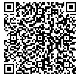

This TIP introduces a URI scheme for Terra payments, which aims to establish a standard format for encoding **payment request** details into a serial URI format that can be loaded by a variety of user-facing Terra wallet applications to simplify user experience.

TIP-42 draws inspiration from URI schemes for payments in well-established blockchain protocols, such as BIP21 and EIP67.

NOTE: "Terra Payments," as employed in this document, refers specifically to a simple transaction which includes a `MsgSend`, conveying the properties of

- sender (Terra address)
- recipient (Terra address)
- amount, a set of Coins of varying denominations.

## Motivation

Currently, the procedure for Terra payments is based on manual input entry for the majority of Terra wallet and client applications (such as station).

This TIP would allow users to simply paste in a URL, click a link, or scan a QR code which would populate the necessary payment details instead of having to enter fields in, where errors in payment address, amount, memo, and fee may arise.

## Specification

### General rules for handling

Terra clients MUST NOT act on URIs without getting the user's authorization. They SHOULD require the user to manually approve each payment individually, though in some cases they MAY allow the user to automatically make this decision.

## Operating system integration

Graphical Terra clients SHOULD register themselves as the handler for the `terra:` URI scheme by default, if no other handler is already registered. If there is already a registered handler, they MAY prompt the user to change it once when they first run the client.

## General Format

Terra Payment URIs will follow the general format for URIs as set forth in RFC 3986. The path component consists of a Terra address, and query component provides additional payment options.

Elements of the query component may contain characters outside the valid range. These must first be encoded according to UTF-8, and then each octet of the corresponding UTF-8 sequence must be percent-encoded as described in RFC 3986.

```
terra:<address>[?amount=<coins>][?memo=<memo>]

address = Terra Bech32 account address of recipient
coins = comma-separated list of Coins of <amount><denom>
  amount = [0-9]+
  denom = e.g. uluna, ukrw, ...
memo = URI-encoded string
```

### Examples

Just the recipient address:

```
terra:terra1ynyqq7edzs6lk6ux9ez6p9f58t8yh66efj6fkj
```

Address and amount:

```
terra:terra1ynyqq7edzs6lk6ux9ez6p9f58t8yh66efj6fkj?amount=15000uluna
```

Address and amount (multiple denominations):

```
terra:terra1ynyqq7edzs6lk6ux9ez6p9f58t8yh66efj6fkj?amount=15000uluna,9321ukrw
```

Address, amount, and memo `1389292012`:

```
terra:terra1ynyqq7edzs6lk6ux9ez6p9f58t8yh66efj6fkj?amount=15000uluna,9321ukrw&memo=1389292012
```

Address, amount, and memo `façon inouïe 떡 油潑扯麵`:

```
terra:terra1ynyqq7edzs6lk6ux9ez6p9f58t8yh66efj6fkj?amount=15000uluna,9321ukrw&memo=fa%C3%A7on%20inou%C3%AFe%20%EB%96%A1%20%E6%B2%B9%E6%BD%91%E6%89%AF%E9%BA%B5
```

The above, as a QR code:



## Implementation

To be announced.

## Notable Problems

TIP-42 may be prone to man-in-the-middle attacks since the the payment address and information are encoded in plaintext. To counter this, we may propose a visual checksum feature where the payment requester can pre-generate an image and share it with the sender, such that the sender can visually verify it before sending.

Another way might to defend against such attacks would be to support a signed-payload scheme where the contents of the payment request is signed, and the signature is sent alongside the payment request in the payment URI. Once TNS rolls out, we can make sure that the domain-name associated with the address is shown (if any).
